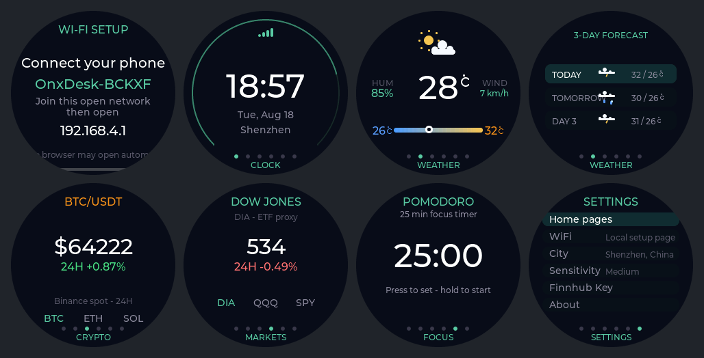

# OnxDesk

OnxDesk is an independent open-source prototype for a small, multi-function
desktop companion. It combines a round display, a rotary encoder, Wi-Fi, and
internet data into a glanceable desk object for time, weather, markets, crypto,
and focus sessions.

It is built with ESP-IDF and LVGL 9. The current implementation targets the
OpenNextion ONX2424G013 round rotary display, but OnxDesk is not an official
OpenNextion project, product, firmware release, or endorsement. It is a
community prototype made to explore this form factor.

  

## Project goals

- Make a compact desk display that is useful without a phone app running all day.
- Keep initial setup simple: city search instead of latitude/longitude and
  keyless data sources wherever practical.
- Keep private configuration, such as Wi-Fi credentials and personal API keys,
  on the device.
- Use a hardware abstraction approach that can be adapted to other prototype
  rotary displays in the future.

## Supported hardware

| Board | Display | Input | Status |
| --- | --- | --- | --- |
| [OpenNextion ONX2424G013][onx2424g013-wiki] | 1.28 inch, 240×240 GC9A01N round LCD | Rotary encoder and BOOT button | Current implementation target |

The ONX2424G013 is the first OpenNextion-family board supported by this
repository. Support for other OpenNextion boards may be added later.

The OnxDesk application is also suitable in principle for other ESP32-based
prototype rotary displays. A port still requires board-specific work for the
LCD driver, display rotation and colour order, input GPIOs, memory layout, and
power/backlight control. Compatibility with any other board is not implied.

## What OnxDesk does

| Channel | Purpose | Data source | User configuration |
| --- | --- | --- | --- |
| Clock | Local time | SNTP | Wi-Fi only |
| Weather | Current conditions and three-day forecast | Open-Meteo | Select a city in the local setup page; no API key |
| Crypto | BTC, ETH, and SOL spot quotes | Binance public spot market data | None |
| Markets | Dow Jones, Nasdaq-100, and S&P 500 ETF proxies | Finnhub | Personal API key |
| Focus | Pomodoro and countdown timer | Device-local | None; 25 minutes by default, adjustable from 1 to 120 minutes |

- The firmware does not scrape finance websites.
- Market API keys are stored in device NVS. They are never committed to the
  repository or printed to logs.
- **Settings → Home pages** can hide Weather, Crypto, Markets, and Focus from
  top-level rotation. Clock and Settings always remain available.
- **Settings → About** shows the project name, exact ESP-IDF firmware version,
  and a QR code for the GitHub Issues page.

## Quick start

1. Power on a new device, or factory-reset it by holding **BOOT** (GPIO0) for
   three seconds.
2. OnxDesk creates an open `OnxDesk-ABCDE` Wi-Fi network and shows its exact
   name on the display.
3. Join that network with a phone. If a captive portal does not open, browse to
   [http://192.168.4.1](http://192.168.4.1).
4. Choose a 2.4 GHz Wi-Fi network or enter its SSID, then enter the password.
5. After the device connects, join the phone to the same router and scan the
   on-screen QR code to open the local city setup page.
6. Search for and save a city. OnxDesk then synchronizes time and weather and
   opens the Clock screen.

The final five characters of the setup-network name are derived from the
device identity. They distinguish devices while remaining unchanged across
normal restarts and factory resets.

### Optional: enable Markets with a Finnhub API key

1. Open [Finnhub](https://finnhub.io/) and select **Get free API Key**, or use
   the usual account-registration flow.
2. After signing in, open the Finnhub Dashboard to find and copy your API key.
3. Send or copy the key to the phone you will use for OnxDesk setup, so it is
   ready to paste into the local settings page.
4. On the device, open **Settings → Finnhub Key**, confirm the same-router
   prompt, then short-press to display the setup QR code and save the key.
5. If a key is already saved, the local page shows only a masked tail such as
   `****qu30`. Paste a new key and select **Replace API key** to change it.

Treat the API key as a private credential. Do not post it in issues, logs, or
public screenshots.

## Controls

| Control | Normal behaviour |
| --- | --- |
| Rotate encoder | Move between visible channels or menu entries |
| Short press | Enter, confirm, or acknowledge a timer reminder |
| Long press | Return one level or perform the page-specific secondary action |
| Hold BOOT for 3 seconds | Restore factory settings |

Factory reset clears Wi-Fi, city, time zone, Finnhub API key, preferences, and
cached data.

### Weather

- Short-press on the Weather channel to switch between current conditions and
  the three-day forecast.
- The temperature range uses the daily low and high, with the current
  temperature marked on the bar.

### Focus timer

1. The default Focus duration is a 25-minute Pomodoro.
2. Short-press on Focus to enter time adjustment.
3. Rotate in five-minute steps from 5–120 minutes, or in one-minute steps
   between 1–5 minutes.
4. Short-press to confirm the duration. Long-press to start or pause the timer.
5. While paused, short-press to resume, or long-press to cancel and restore the
   selected duration.

- A small orange progress ring appears on other top-level pages while a timer
  runs.
- At zero, OnxDesk opens Focus and alternates red and black for three minutes.
  If it is not acknowledged, it stays quiet for ten minutes and repeats the
  three-minute alert until a short press acknowledges it.
- Acknowledging the alert returns to the normal Focus page with the selected
  duration restored. Rotate normally to move to another channel.

## Local setup after first use

The local settings centre remains available while OnxDesk is powered on and
connected to Wi-Fi.

1. Open **Settings → City** or **Settings → Finnhub Key** on the device.
2. Join the phone to the same Wi-Fi as OnxDesk.
3. Open the displayed `http://…/settings` address, or scan the on-screen QR
   code where available.
4. Update the city or personal Finnhub API key.

City search only runs after OnxDesk has network access. The Finnhub key is
saved only in device NVS and is not shown again.

## Hardware reference

This table is for firmware development and troubleshooting; normal users do
not need it.

| Function | GPIO |
| --- | --- |
| LCD SCLK / MOSI / CS / DC / BL / RST | 5 / 1 / 2 / 3 / 6 / 8 |
| Encoder A / B | 48 / 47 |
| Encoder press | 9 |
| BOOT | 0 |

## Current status and direction

- The project currently supports one round rotary display: ONX2424G013.
- Hardware bring-up, display orientation/colour validation, Wi-Fi provisioning,
  local settings, SNTP, city search, weather, crypto, market-key setup, and
  Focus interactions are implemented in the prototype.
- Future work may add support for more OpenNextion boards and other compatible
  prototype rotary displays, subject to available hardware and validation.
- Report issues or propose changes through the
  [GitHub Issues page](https://github.com/OpenNextion/OpenNextion-Example-OnxDesk/issues).

## Data and project disclaimer

- OnxDesk is an independent community prototype. It is not an official
  OpenNextion project or product.
- Data is retrieved from third-party internet services and may be delayed,
  incomplete, unavailable, changed, or incorrect.
- This project is for informational and experimental use only. It does not
  constitute investment, financial, trading, weather-safety, or other
  professional advice.
- You are responsible for independently verifying data, following provider terms
  of use, protecting private credentials, and understanding the risks of
  flashing and using prototype firmware.

[onx2424g013-wiki]: https://nextion.tech/wiki/onx2424g013/
